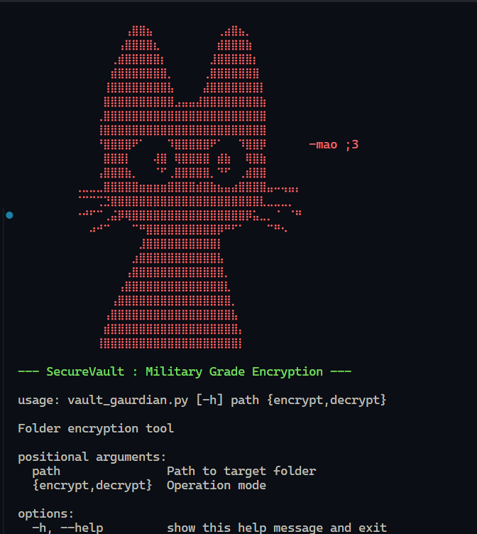

# **🔒 SecureVault - Military Grade Folder Encryption**

 *ASCII art version included in code*

A Python-based solution for securing sensitive directories with AES-256 encryption, featuring both content and filename encryption.

## 🌟 Features

- **Military-Grade Encryption**: AES-256 in CBC mode via Fernet
- **Dual Protection**: Encrypts both file contents **and** filenames
- **Secure Key Derivation**: PBKDF2HMAC with 600,000 iterations
- **Tamper Detection**: Automatic corruption detection
- **Cross-Platform**: Works on Windows, Linux, and macOS
- **Stealth Mode**: Leaves no visible trace of original filenames
- **Self-Contained**: No external dependencies beyond Python

## ⚙️ Installation

### Requirements

- Python 3.7+
- cryptography library

```bash
pip install cryptography
```
# **🚀 Usage**

## Encryption

```Bash
python securevault.py /path/to/folder encrypt
```

## Encryption

```Bash
python securevault.py /path/to/folder decrypt
```

You'll be prompted to enter and confirm your encryption password.

# **🔐 Security Architecture**

## Key Components

- Password Derivation: PBKDF2HMAC-SHA256 (600k iterations)
- Content Encryption: AES-256-CBC with random IVs
- Filename Encryption: Fernet tokens
- Authentication: HMAC signature verification

## Security Features

- Brute-force protection through high iteration count
- Automatic salt generation and storage
- Tamper-proof encrypted headers
- Secure temp file handling during operations

## ⚠️ Important Notes

### 1. Password Security

- No password recovery mechanism
- Use strong, memorable passwords
- Store passwords in a secure manager


### 2. File Handling

- Always maintain backups
- Test with non-critical files first
- Not recommended for files >1GB

### 3. System Markers
- Never delete `.vault_salt` or `.vault_marker`
- Keep entire directory structure intact

## 🛡️ Threat Model

### Protects against:

- Physical theft of storage devices
- Unauthorized file system access
- Casual forensic analysis
- Directory enumeration attempts

### Does not protect against:

- Memory analysis during operations
- Keylogger attacks
- Compromised execution environments

## 🚧 Limitations

- Experimental status - use at own risk
- No file metadata encryption
- No multi-user support
- Limited error recovery capabilities

## 🧠 How It Works

### Encryption Process

1. Generate random 16-byte salt
2. Derive key using PBKDF2HMAC
3. Encrypt filenames with Fernet
4. Encrypt file contents in CBC mode
5. Create verification markers

### Decryption Process

1. Verify marker existence
2. Load stored salt value
3. Re-derive encryption key
4. Validate HMAC signatures
5. Decrypt contents and filenames

## 🤝 Contributing

Contributions welcome! Please follow these steps:

1. Open an issue to discuss changes
2. Fork the repository
3. Create feature branch
4. Submit PR with detailed description

## 📜 License

MIT License - Add license file to repo

## 🙏 Acknowledgments

- Cryptography.io team for excellent Python bindings
- PEP-8 for code style guidelines
- ASCII art community for cool logo designs